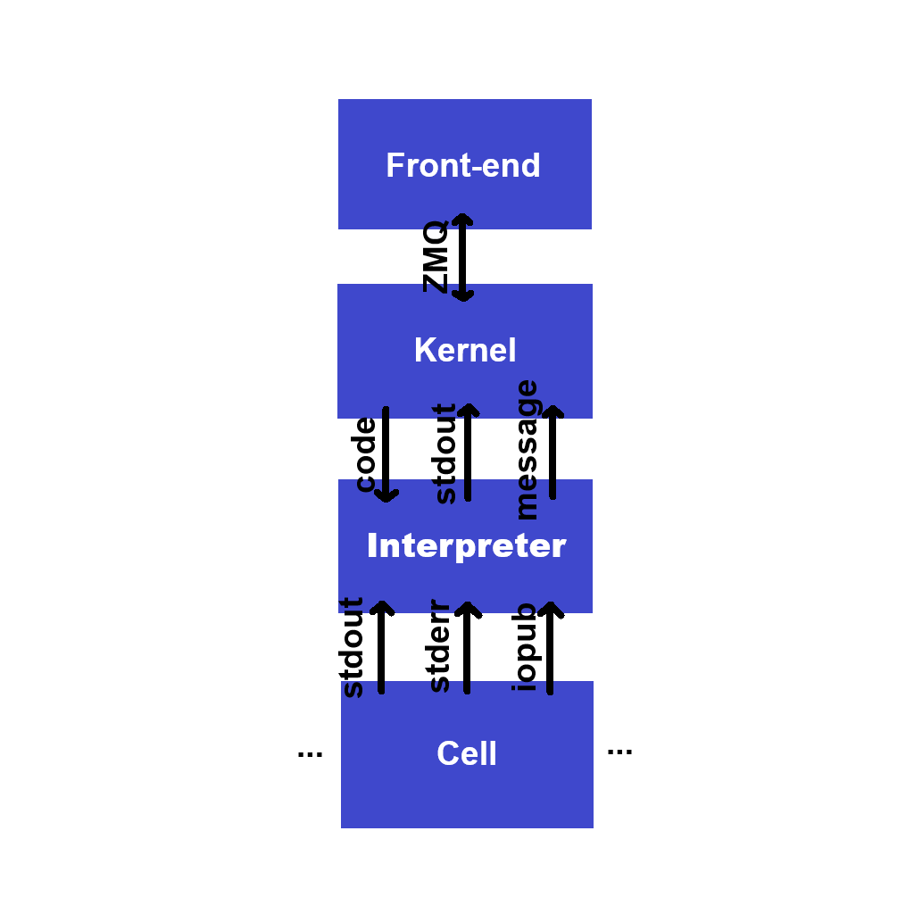

+++
date = '2025-07-23T15:13:58+03:00'
draft = false
title = 'Design'
+++

## Cell

Compiled by _Odin_, loaded and executed by the _Interpreter_ in its own thread. Sends responses to the _Interpreter_ by named pipes.

## Interpreter

Receives commands from the _Kernel_. Creates, executes, and deletes _Cells_, and forwards their responses to the _Frontend_.

## Frontend

GUI for writing notebooks. Communicates with the _Interpreter_ using ZeroMQ messaging protocol.
